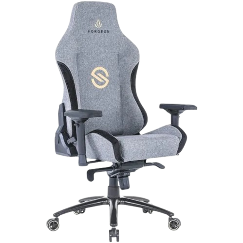
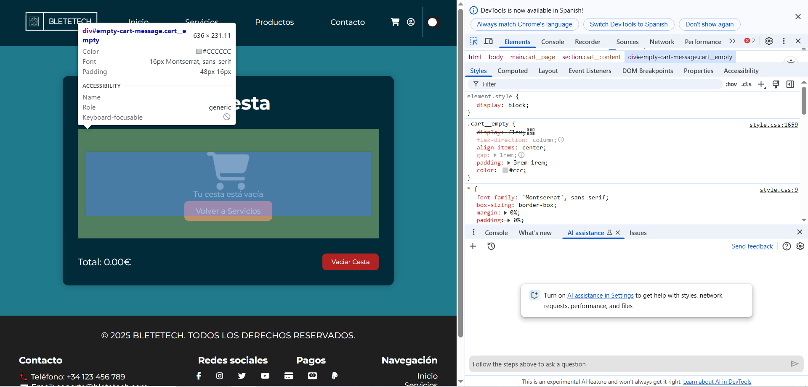
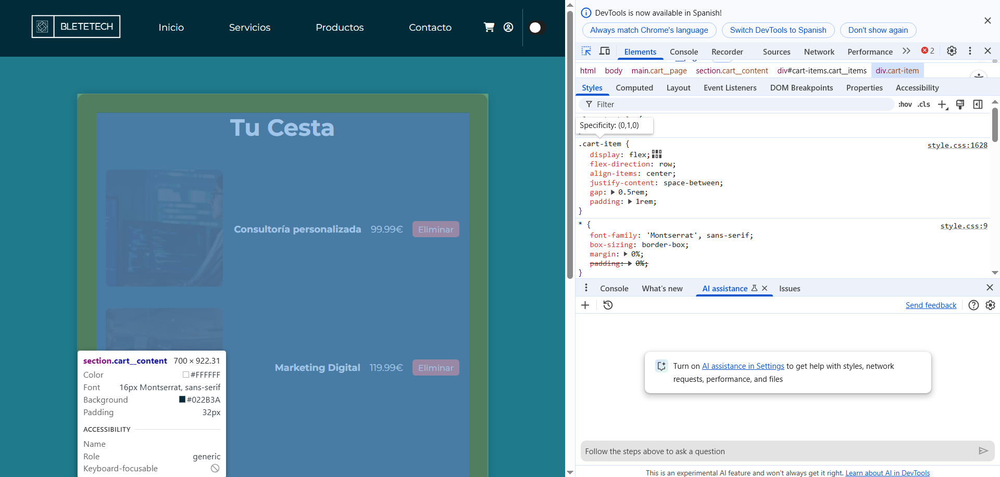
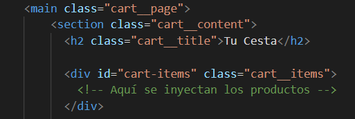

# Proyecto BleteTech

## Descripción

BleteTech es un sitio web dedicado a la venta de productos tecnológicos, como portátiles, componentes, periféricos, smartphones, y más. El sitio también ofrece servicios y una interfaz de contacto donde los usuarios pueden comunicarse con la empresa directamente. Además, cuenta con una sección de suscripción a un boletín de noticias y actualizaciones sobre las ofertas y novedades de la tienda.

Este proyecto fue diseñado con un enfoque moderno y accesible, utilizando tecnologías web como HTML, CSS, y JavaScript.

---

## Tecnologías Utilizadas

- **HTML**: Estructura básica del contenido de las páginas.
- **CSS**: Diseño visual y estilización de la interfaz.
- **JavaScript**: Interactividad de la página, incluyendo el modo oscuro y funcionalidades adicionales.
- **Font Awesome**: Iconos para mejorar la experiencia visual.
- **Google Fonts**: Uso de la fuente Montserrat para la tipografía.

---

## Características del Proyecto

### Páginas Principales

1. **Página de Inicio (index.html)**: Página principal con un acceso directo a los productos y servicios ofrecidos.
2. **Página de Productos (productos.html)**: Muestra una variedad de productos disponibles en la tienda con imágenes representativas y enlaces para más detalles.
3. **Página de Servicios (servicios.html)**: Presenta los servicios tecnológicos ofrecidos por BleteTech.
4. **Página de Contacto (contacto.html)**: Permite a los usuarios enviar mensajes a través de un formulario de contacto, además de permitirles editar su perfil personal.

### Funcionalidades Especiales

- **Modo Oscuro**: Los usuarios pueden activar o desactivar el modo oscuro para mejorar la experiencia visual.
- **Boletin de Suscripción**: Los usuarios pueden suscribirse a un boletín de noticias con ofertas exclusivas y actualizaciones.
- **Formulario de Contacto**: Los usuarios pueden enviar consultas o preguntas directamente a la empresa.
- **Mapa de Localización**: Muestra la ubicación de la tienda física en Google Maps.

### Etiquetas HTML Utilizadas

A continuación se presentan las principales etiquetas HTML utilizadas en el desarrollo de este proyecto:

- **Estructura Básica**:
  - `<html>`, `<head>`, `<body>`

- **Navegación y Contenido**:
  - `<header>`, `<nav>`, `<article>`, `<footer>`

- **Secciones de la Página**:
  - `<section>`, `<h1>`, `<h2>`, `<h3>`

- **Formularios**:
  - `<form>`, `<input>`, `<textarea>`, `<button>`, `<label>`

- **Enlaces y Listas**:
  - `<a>`, `<ul>`, `<li>`

- **Imágenes**:
  - ``

- **Multimedia y Contenido Externo**:
  - `<iframe>`

- **Estilos y Diseño**:
  - `<span>`

- **Fuentes Externas y Scripts**:
  - `<link>`, `<script>`

Cada una de estas etiquetas juega un papel crucial en la organización y funcionalidad de las páginas, garantizando una experiencia de usuario fluida y accesible.


### Diseño Responsivo

El diseño de las páginas es totalmente adaptativo para que el sitio sea accesible y visualmente atractivo en dispositivos móviles y de escritorio.

---
```
BleteTech/
├── assets/
│   └── img/               # Imágenes utilizadas en el proyecto
├── css/
│   └── style.css          # Archivo de estilo principal
├── js/
│   ├── darkmode.js        # Script para el cambio entre modo claro y oscuro
│   └── animacion.js       # Animaciones para los botones y transiciones
│   └── script.js          # Script de la segunda parte del proyecto
├── index.html             # Página de inicio
├── productos.html         # Página de productos
├── servicios.html         # Página de servicios
├── contacto.html          # Página de contacto
└── README.md              # Este archivo
```

#### PRUEBA DE VALIDACIÓN DEL CSS

# Proyecto 3 | Fase 2

En este proyecto aplicamos...

Selección de Elementos en el DOM: Se utilizan diferentes métodos para acceder a elementos de la página, incluyendo getElementById, querySelector, querySelectorAll y getElementsByClassName. Estos permiten seleccionar elementos de manera eficiente y manipular su contenido o estilos.

Manipulación del DOM: Se aplican modificaciones dinámicas, como cambiar el texto de un título, alterar los estilos de un botón al hacer clic, eliminar elementos de la página y agregar nuevos elementos dinámicamente.

## Apartado 1: Selección de Elementos en el DOM

- **1. Selección por ID:**

```javascript
const botonContacto = document.getElementById('botonContacto');
console.log(botonContacto);
```
- **2. Selección con querySelector (primer elemento que coincide con el selector):**

```javascript
const primerMenuLink = document.querySelector('.header__menu-link');
console.log(primerMenuLink);
```

- **3. Selección con querySelectorAll (todos los elementos que coinciden con el selector):**

```javascript
const todosMenuLinks = document.querySelectorAll('.header__menu-link');
console.log(todosMenuLinks);

todosMenuLinks.forEach(link => {
    console.log(link.textContent);  // Muestra el texto de cada enlace en el menu
});
```

- **4. Selección con getElementsByClassName (colección de elementos con la clase especificada):**

```javascript
const caracteristicasItems = document.getElementsByClassName('caracteristicas__item');
console.log(caracteristicasItems);
```

## Apartado 2: Manipulación del DOM

- **1. Cambio de Contenido de Título**

```javascript
const bienvenidaTitle = document.querySelector('.bienvenida__title');
bienvenidaTitle.textContent = "Bienvenido a BLETETECH: Innovación Tecnológica";
console.log(bienvenidaTitle);
```

- **2. Cambio de Estilo en un Botón**

```javascript
const a = document.getElementById('changeColorButton');
const bienvenidaSection = document.querySelector('.bienvenida__cta');

a.addEventListener('click', () => {
    bienvenidaSection.style.backgroundColor = '#022B3A'; // Cambio a color primario
    console.log('Color de fondo cambiado');
});
```

- **3. Eliminación de Elementos (Eliminar el último producto)**

```javascript
const listaProductos = document.querySelector('.products__flex');
const ultimoProducto = listaProductos.lastElementChild;

if (ultimoProducto) {
    ultimoProducto.remove();
    console.log('Producto eliminado');
}
```

- **4. Agregar un Nuevo Producto Dinámicamente**

```javascript
const nuevoProducto = document.createElement('li');
nuevoProducto.classList.add('product-card');  

nuevoProducto.innerHTML = `
    <h3 class="product-card__title">Samsung Galaxy S24</h3>
    
    <a href="https://www.pccomponentes.com/samsung-galaxy-s24" class="product-card__link">Ver más</a>
`;

listaProductos.appendChild(nuevoProducto);
console.log(nuevoProducto);
```

# Proyecto 3 | Fase 3

## IMPORTANTE
Para el apartado de los filtros y demás, he creado una página nueva, al igual que con la cesta. Para llegar a esta página
debemos ir a: Productos - Portátiles y Ordenadores. Esta será la única que sea interactiva.

# Autoevaluación | Explicación del Proyecto – Funcionalidades Interactivas

A continuación, presento mi evaluación personal del proyecto, analizando cada uno de los criterios indicados. He intentado aplicar JavaScript moderno (ES6+) en las funcionalidades, como en el dark mode, la validación del formulario, el carrito de compras y el sistema de filtros. A continuación, intento explicar lo necesario sobre cada criterio.

---

## Criterio 3.a: Lenguajes de Script y ECMAScript

**Lo que hice:**
- Utilicé JavaScript para implementar la funcionalidad interactiva de la página.
- He empleado ES6+ (uso de `const` y `let`, uso de template literals y algunos arrow functions) en varias partes del proyecto.
- El código está organizado en bloques (modo oscuro, validación, carrito y filtros), como exige la práctica en un mismo archivo.

**Aspectos positivos:**
- Se evidencia el uso de técnicas modernas para manipular el DOM.
- Las funcionalidades están bien separadas y cumplen las necesidades del proyecto.

---

## Criterio 3.b: Sintaxis Básica de JavaScript

**Lo que hice:**
- Declaro variables con `let` y `const` y uso template literals para construir cadenas dinámicamente.
- Aunque en algunas partes uso la sintaxis clásica de funciones, aunque en general se aprovechan las características de ES6.

**Aspectos positivos:**
- El código es claro, estructurado y funcional.
  

---

## Criterio 3.c: Selección y Acceso a Elementos del DOM

**Lo que hice:**
- Utilizo métodos como `document.getElementById`, `querySelector` y `querySelectorAll` de forma consistente para manipular elementos (por ejemplo, para el dark mode, el formulario, los filtros y el carrito).

**Aspectos positivos:**
- La selección de elementos está bien enfocada y permite un acceso rápido y efectivo al DOM.

---

## Criterio 3.d: Creación y Modificación de Elementos del DOM

**Lo que hice:**
- En la funcionalidad del carrito, creo elementos dinámicamente usando `document.createElement` y los añado al DOM con `appendChild`.
- Actualizo el contenido dinámicamente usando `innerHTML`.

- Demostracion:
  - Como se puede comprobar en esta imagen, la cesta está vacia,  
    
  - Sin embargo, una vez añadimos articulos, asi quedaria esteticamente, y la manipulación del DOM seria la siguiente:
    

  - Documento HTML donde se indica la inyeccion:
    


**Aspectos positivos:**
- La creación y modificación dinámica de los elementos es clara y permite una experiencia interactiva en tiempo real.

---

## Criterio 3.e: Eliminación de Elementos del DOM

**Lo que hice:**
- Para eliminar ítems del carrito, filtro el array y actualizo el DOM dependiendo del seleccionado.
- Se utiliza la eliminación de elementos de forma que se mantiene el DOM limpio y funcional.

**Aspectos positivos:**
- La eliminación se realiza correctamente sin errores, y se controla de forma precisa el contenido mostrado.

---

## Criterio 3.f: Modificaciones Dinámicas de Estilos

**Lo que hice:**
- Implementé el modo oscuro utilizando `classList.toggle` para cambiar entre estilos.
- Se realiza una modificación dinámica de estilos para animar la sección del newsletter al hacer scroll (ajustando opacidad y transformación).

**Aspectos positivos:**
- Los cambios de estilo son coherentes con el diseño y responden adecuadamente a las interacciones del usuario.

---

## Uso de localStorage

**Lo que hice:**
- En la funcionalidad del carrito, utilizo `localStorage` para guardar y recuperar los productos añadidos.  
- Esto permite que la información del carrito persista incluso al recargar la página, mejorando la experiencia de usuario.
- Además, la preferencia del modo oscuro se guarda en `localStorage`, lo que garantiza que el tema seleccionado se mantenga a lo largo de las sesiones.

**Aspectos positivos:**
- El uso de `localStorage` es correcto y mejora la funcionalidad interactiva de la aplicación.
- Permite mantener datos importantes (como el estado del carrito y el tema) de manera persistente.

---

## Autor
Este proyecto fue desarrollado por Pablo Fernandez, creador de BleteTech.
